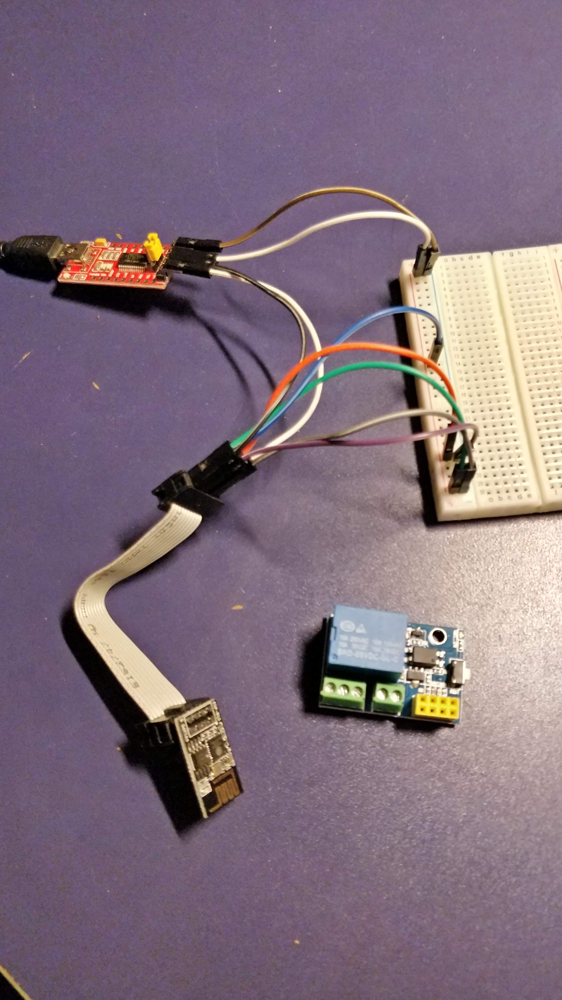
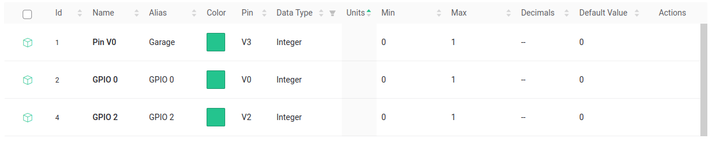

# ESP01S (ESP8266) relay

## Programming 

You need USB to TTL board, which connects to ESP01, then use Arduino IDE to flash code.

### Arduino IDE setup

#### Add rights to use /dev/usb

https://www.arduino.cc/en/Guide/Linux

```sh
sudo usermod -a -G dialout `whoami`
sudo usermod -a -G tty `whoami`
sudo reboot # logout + login was not enough on ubuntu... :/
```
From: https://www.arduino.cc/en/Guide/Linux


#### Install ESP lib

Preferences -> Additional Boards Manager URLs -> `http://arduino.esp8266.com/stable/package_esp8266com_index.json`

Go to: Tools -> Board -> Boards Manager -> search `esp` -> Install

From: https://randomnerdtutorials.com/how-to-install-esp8266-board-arduino-ide/


### Schema for programming via Arduino IDE

| USB to TTL 	| ESP01S 	| Comment                                  	|
|------------	|--------	|------------------------------------------	|
| DRT        	| --     	| Don't connect                            	|
| RX         	| TX     	|                                          	|
| TX         	| RX     	|                                          	|
| VCC        	| 3v3    	| Make sure to set 3V via jumper           	|
| CTS        	| --     	| Don't connect                            	|
| GND        	| GND    	|                                          	|
| VCC        	| RST    	| Reset need to by HIGH during programming 	|
| VCC        	| EN     	| Chip enable needs to by HIGH             	|
| GND        	| IO0    	| IO0 put to ground                        	|
| --         	| IO2    	| Don't connect                            	|

---

- Connect USB to PC, LED should start to glow red
- In Arduino IDE select `Tools -> Board -> ESP8266`
- You are now ready to Compile and Upload code to ESP01!

### Schema image



## Blynk setup

- Read docs: https://docs.blynk.io/en/
- Example generatior: https://examples.blynk.cc/?board=ESP8266&shield=ESP8266%20WiFi&example=GettingStarted%2FVirtualPinRead




# TODOS

- Clarify DEEP_SLEEP (how to reduce power uasge?)
- How to power externally